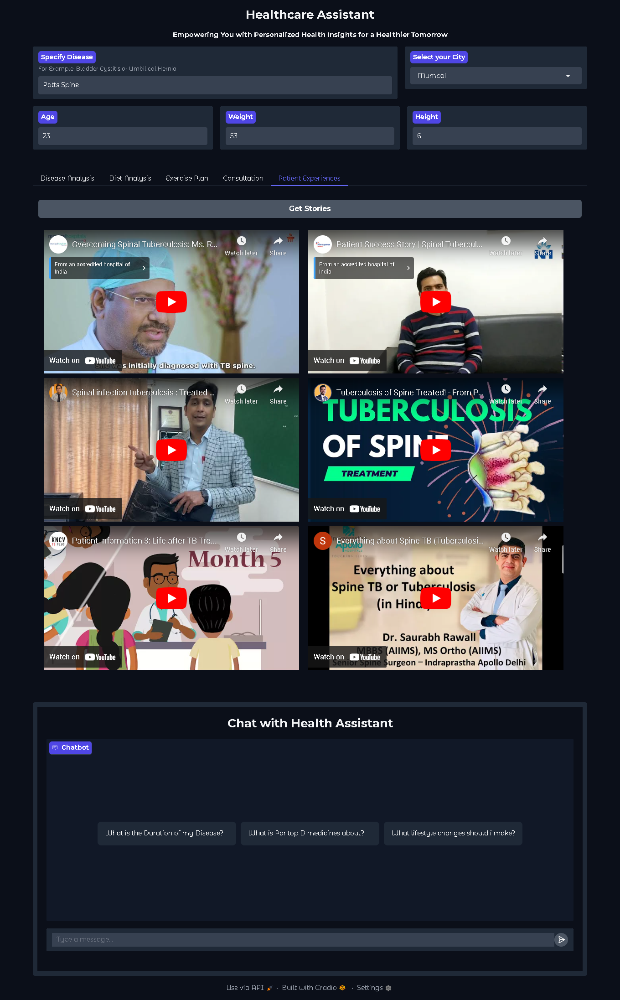

# Healthcare Agentic AI Assistant 🏥🤖  

Healthcare Agentic AI Assistant is an intelligent and comprehensive solution designed to make healthcare information easily accessible. This smart assistant uses advanced Multi-Agent AI systems, leveraging over 10+ agents working asynchronously to perform 20+ tasks. From disease research to personalized diet and exercise plans, as well as doctor consultations and patient journeys, it brings all essential healthcare services into a single platform.
Additionally, a chat interface is available where users can ask any medical query and receive precise, well-researched answers.   

Our mission? To provide the **best healthcare assistance, all in one place**! 🌟  

---

## 🖼️ Results Images  

Take a look at the detailed insights generated by our Healthcare AI Assistant:  

<details>  
  <summary>📄 Disease Research Report</summary>  
    
</details>  

<details>  
  <summary>🥗 Diet Research Report</summary>  
    
</details>  

<details>  
  <summary>🏋️‍♂️ Exercise Research Report</summary>  
    
</details>  

<details>  
  <summary>🩺 Doctor Consultations</summary>  
    
</details>  

<details>  
  <summary>🎥 Patient Experiences</summary>  
    
</details>

<details>  
  <summary>💬 Chat Interface</summary>  
    
</details>

---

## 🚀 Features  

1. **Disease Research Reports** 📑  
   Our AI agents analyze data from 40+ verified medical websites to generate **detailed disease research reports** tailored to your queries.  

2. **Diet Recommendations** 🥗  
   Get a personalized diet plan! AI agents scour 40+ trusted sources to provide a **detailed diet analysis** for specific medical conditions.  

3. **Exercise Plans** 🏋️‍♂️  
   Receive exercise recommendations based on your condition. AI agents search 40+ platforms to create a **comprehensive exercise analysis report**.  

4. **Doctor Consultation (Practo Integration)** 🩺  
   Find the right doctor based on qualifications and expertise! Using the **Practo API**, AI agents fetch doctor recommendations with detailed profiles.  

5. **Patient Experiences via YouTube** 🎥 
   AI agents gather relevant YouTube videos that showcase **real-life patient journeys**, offering valuable insights and experiences.  

6. **Chat Interface for Medical Queries** 💬  
   Ask any medical question in the **chat interface** and receive a comprehensive, well-researched answer. 

---

## 🛠️ Tools and Libraries  

- **[CrewAI](https://docs.crewai.com/introduction)**: Multi-agentic framework enabling seamless collaboration between agents.  
- **[LangChain](https://python.langchain.com/docs/introduction/)**: Framework for building AI-driven applications.  
- **[AgentOps](https://docs.agentops.ai/v1/introduction)**: A debugging toolkit for agentic AI systems.  
- **[OpenAI LLM](https://platform.openai.com/docs/concepts)**: Cutting-edge language model powering smart interactions.  
- **[SerperTool](https://docs.crewai.com/tools/serperdevtool)**: Enhancing search precision.  
- **[TavilySearchTool](https://docs.tavily.com/)**: For advanced data extraction.  
- **[DuckDuckGoSearch](https://python.langchain.com/docs/integrations/tools/ddg/)**: Privacy-focused search tool integration.  
- **[Practo API](https://practo.com)**: Fetching doctor data seamlessly.  
- **[YouTube Search](https://docs.crewai.com/tools/youtubevideosearchtool)**: For discovering relevant patient experience videos.  

---

## 🔑 API Keys Needed  

To use the Healthcare AI Assistant, you’ll need the following API keys:  

1. **OpenAI API Key**: [Register here](https://openai.com/index/openai-api/)  
2. **AgentOps API Key**: [Register here](https://app.agentops.ai/account)  
3. **Tavily API Key**: [Register here](https://tavily.com/)  
4. **SerperTool API Key**: [Register here](https://serper.dev/)  

---

## ⚙️ Setup and Installation  

Follow these steps to get started with the Healthcare AI Assistant:  

1. **Create an `.env` file** with the following keys:  

```env
OPENAI_API_KEY=<your_openai_api_key>
AGENTOPS_API_KEY=<your_agentops_api_key>
SERPER_API_KEY=<your_serper_api_key>
TAVILY_API_KEY=<your_tavily_api_key>
``` 

2. **Install dependencies and run the application**:

```env
pip install -r requirements.txt
gradio UI.py
``` 

🌟 **Join us on this journey to revolutionize healthcare!** 🌟  
